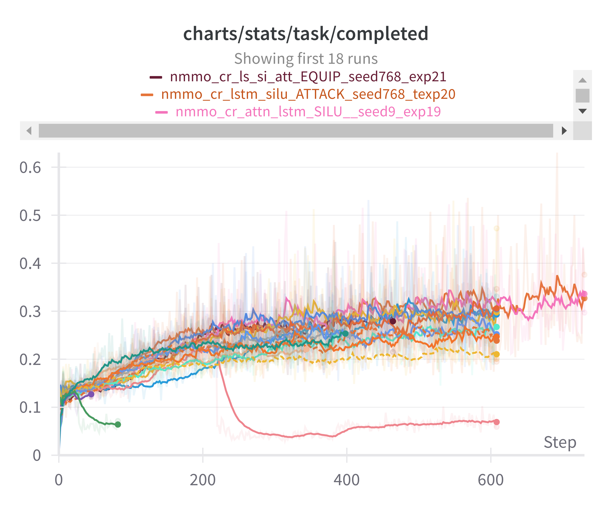
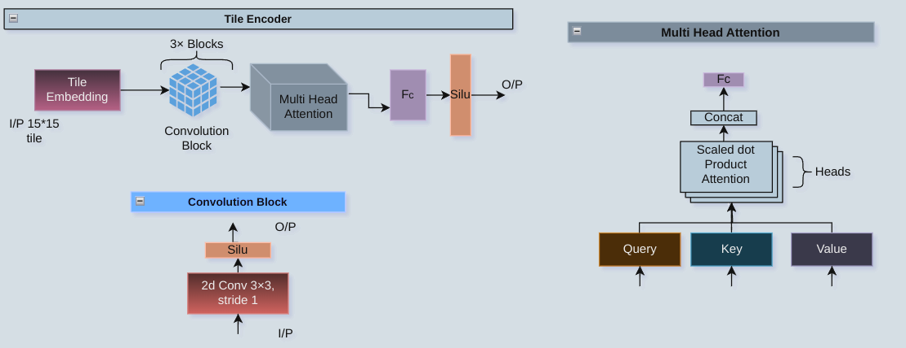
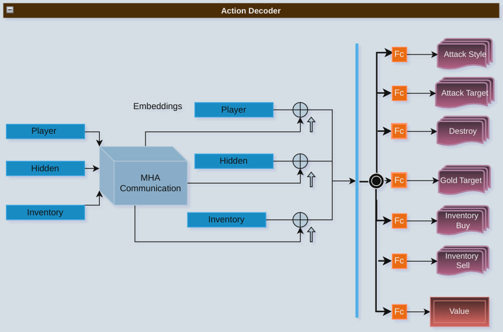
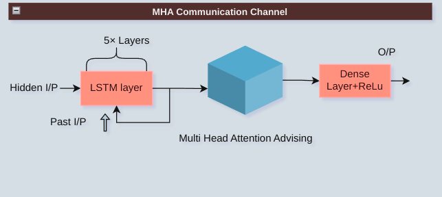

## Running the Script

To run the `train.py` script, navigate to the directory containing the script and run the following command with Config from reinforcement_learning/config.py:

```bash
python train.py
```


#  Welcome to the Platform!
## Experiment Tracking
- 
To track the progress of our experiments and view detailed metrics, visit our experiment tracking dashboard on [Weights & Biases](https://wandb.ai/saidineshpola/nmo_baseline_ppo?nw=nwusersaidineshpola).
## Results

In the "results" folder, you can find the following images:

1. **Visual Tile for Each Agent in NMMO Grid**:
   - 
   - Description: This image represents the visual tile for each agent in the Neural MMO grid, providing insights into the spatial representation of the environment.

2. **Action Decoder of NMMO**:
   - 
   - Description: This is the action decoder architecture of the Neural MMO (NMMO) model.

3. **Multihead Attention Communication Channel between Agents**:
   - 
   - Description: This is the communication channel between agents using multihead attention mechanism.


